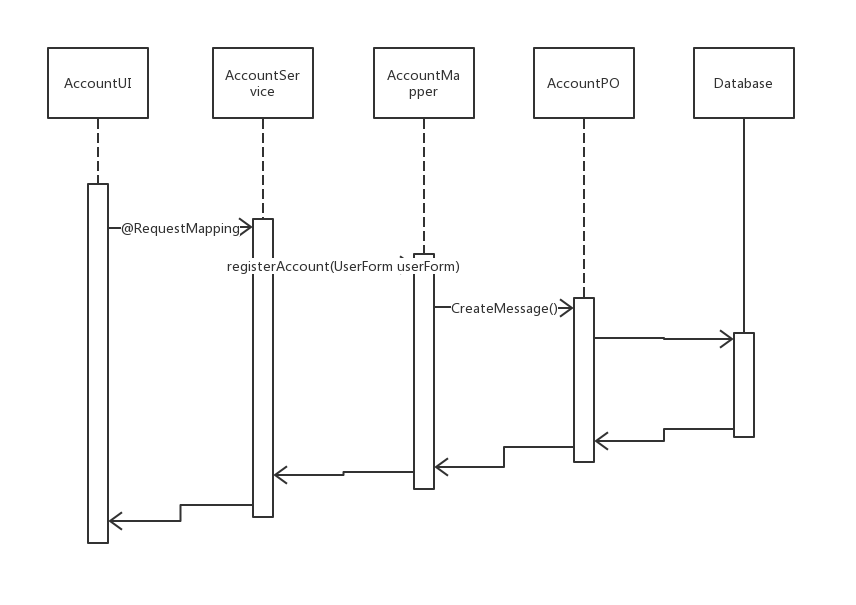
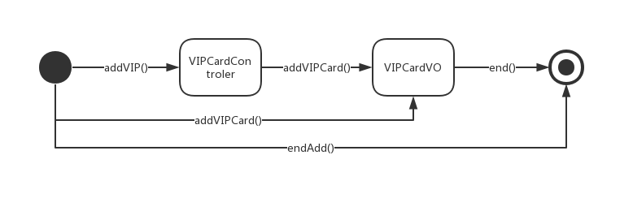
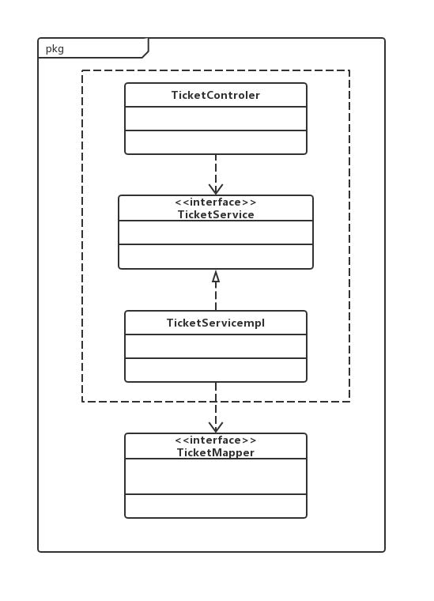
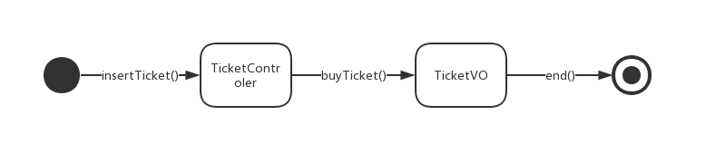

### 4.1.3 accountbl 模块

#### (1)模块概述

accountbl 模块承担的需求参见规格需求说明文档

accountbl模块的职责及借口参见软件体系结构描述文档

#### (2)整体结构

​	根据体系结构设计，我们将系统分为展示层、业务逻辑层、数据层。每一层之间为了增加灵活性，添加了一些接口。在展示层和业务逻辑层之间，根据SpringBoot的机制，通过URL的访问的方式实现和业务逻辑模块交互。而在业务逻辑层于数据持久层之间，则通过主要通过AccountMapper接口进行交流。为了隔离业务逻辑职责和逻辑控制职责，我们增加了AccountController，这样AccountController会将对账户相关业务的处理委托给AccountServicempl对象。根据功能的不同，为了提高内聚性，分了一个接口/实现类来实现AccountController所具备的功能：AccountService。

| 模块               | 职责                            |
| ------------------ | ------------------------------- |
| AccountController  | 实现Account相关的功能的控制逻辑 |
| AccountServiceImpl | 实现Account相关功能的业务逻辑   |

#### (3)模块内部类的接口规范

表 accountbl模块各个类的职责

#### (4)业务逻辑层动态模型

#### (5) 业务逻辑层的设计原理

利用委托式控制风格，每一个界面需要访问的业务逻辑由各自的控制器委托给不同的对象

### 4.1.4 vipbl模块

#### (1)模块概述

vipbl 模块承担的需求参见规格需求说明文档

vipbl模块的职责及借口参见软件体系结构描述文档

#### (2)整体结构

​	根据体系结构设计，我们将系统分为展示层、业务逻辑层、数据层。每一层之间为了增加灵活性，添加了一些接口。在展示层和业务逻辑层之间，根据SpringBoot的机制，通过URL的访问的方式实现和业务逻辑模块交互。而在业务逻辑层于数据持久层之间，则通过主要通过VIPCardMapper接口进行交流。为了隔离业务逻辑职责和逻辑控制职责，我们增加了VIPController，这样VIPController会将对会员相关业务的处理委托给VIPCardServicempl对象。根据功能的不同，为了提高内聚性，分了一个接口/实现类来实现VIPCardController所具备的功能：VIPService。

| 模块               | 职责                            |
| ------------------ | ------------------------------- |
| VIPController  | 实现VIP相关的功能的控制逻辑 |
| VIPCardServiceImpl | 实现VIPCard相关功能的业务逻辑   |

#### (3)模块内部类的接口规范

#### (4)业务逻辑层动态模型

#### (5) 业务逻辑层的设计原理

利用委托式控制风格，每一个界面需要访问的业务逻辑由各自的控制器委托给不同的对象

### 4.1.5 salesbl模块

#### (1)模块概述

salebl 模块承担的需求参见规格需求说明文档

salebl模块的职责及借口参见软件体系结构描述文档

#### (2)整体结构

​	根据体系结构设计，我们将系统分为展示层、业务逻辑层、数据层。每一层之间为了增加灵活性，添加了一些接口。在展示层和业务逻辑层之间，根据SpringBoot的机制，通过URL的访问的方式实现和业务逻辑模块交互。而在业务逻辑层于数据持久层之间，则通过主要通过TicketMapper接口进行交流。为了隔离业务逻辑职责和逻辑控制职责，我们增加了TicketController，这样TicketController会将对销售相关业务的处理委托给TicketServicempl对象。根据功能的不同，为了提高内聚性，分了一个接口/实现类来实现VIPController所具备的功能：TicketService。

| 模块               | 职责                            |
| ------------------ | ------------------------------- |
| TicketController  | 实现Ticket相关的功能的控制逻辑 |
| TicketServiceImpl | 实现Ticket相关功能的业务逻辑   |

#### (3)模块内部类的接口规范

#### (4)业务逻辑层动态模型

​	

#### (5) 业务逻辑层的设计原理

利用委托式控制风格，每一个界面需要访问的业务逻辑由各自的控制器委托给不同的对象

### 